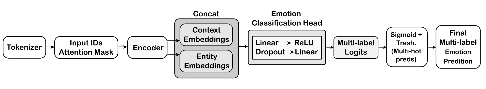

# EMOPIE

### An Emotion Classifier from the Perspective of Intratextual Entities

EMOPIE is a **multi-label transformer-based classifier** designed to
identify **emotions expressed by specific entities (experiencers)**
within a text.\
Traditional emotion classification typically focuses on sentence-level
or author-level sentiment. EMOPIE instead models **entity-dependent
emotional viewpoints**, enabling emotion detection even when multiple
entities appear in the same sentence or passage.

This repository contains the first public implementation of EMOPIE,
including preprocessing, model architecture, training scripts, and
evaluation pipeline (currently configured for the **x-enVENT** dataset).

------------------------------------------------------------------------

## Features

-   **Entity-aware emotion classification**
-   **Multi-label support**
-   **Transformer-based architecture**
-   **Reusable and extensible pipeline**
-   **Clean training script**

------------------------------------------------------------------------

## Repository Structure

    emopie/
    ├── data/
    ├── emopie_clf_x_envent.py
    ├── README.md
    ├── LICENSE
    └── .gitignore

------------------------------------------------------------------------

## Installation

``` bash
git clone https://github.com/antoniomenezes/emopie
cd emopie
python -m venv emopie-env
source emopie-env/bin/activate   # Windows: emopie-env\Scripts\activate
pip install -r requirements.txt
```

------------------------------------------------------------------------

## Model Architecture

EMOPIE merges:

1.  **Global \[CLS\] pooled output**
2.  **Entity span embedding**

The representations are concatenated and passed to a multi-label
classifier.



------------------------------------------------------------------------

## Dataset

The implementation supports the **x-enVENT** dataset.

------------------------------------------------------------------------

## Usage

### Train

``` bash
python emopie_clf_x_envent.py
```

### Evaluate

Automatically performed after training.

------------------------------------------------------------------------

## Metrics

-   Micro/Macro F1\
-   Precision & Recall\
-   Per-emotion results

------------------------------------------------------------------------

## Citation

    Menezes, A.M.A. Moreira, V.P. EMOPIE: Emotion Classification from the Perspective of Intratextual Entities. (2025).

------------------------------------------------------------------------

## License

Apache 2.0 License.
